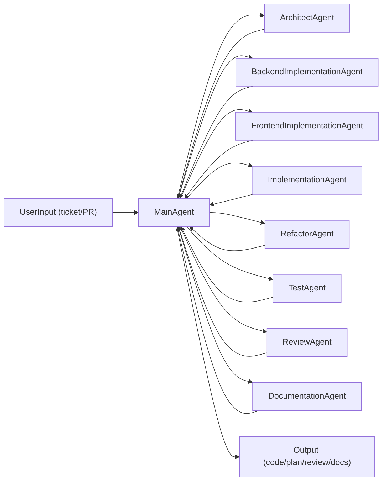

## AI Agent Roles for Laravel Boost

This repository defines **skills and rules** that AI agents consume via **Laravel Boost**.  
Boost acts as the **index** for your codebase and these guidelines (similar to the “Index” box in the second slide you shared).

All agents below are *personas* that read from the same Boost index:

- `RULES.md`
- `resources/boost/skills/**/SKILL.md`
- Any project-level overrides in `.ai/skills/{skill-name}/SKILL.md`

Use these roles when prompting Claude Desktop/Terminal, other Boost-aware tools, or internal orchestrators.

---

### Core Roles

- **ArchitectAgent**
  - Turns tickets or ideas into Laravel‑oriented designs.
  - Responsible for: overall architecture, boundaries, data flow, routes, events, model shapes.
  - Primary skills: `general`, `php`, `helperfunctions`, `migrations`, `enums`, `models`, `traits`, `routing`, `actions`, `services`, `events`, `policies`.

- **BackendImplementationAgent**
  - Implements or updates **backend** code according to the approved design and skills.
  - Responsible for: controllers, actions/services, models, migrations, policies, events, backend-focused helpers, basic backend tests.
  - Primary skills: all from ArchitectAgent **plus** `controllers`, `formrequests`, `middleware`, `requests`, `services`, `phpstan`, `phpunit`, `pesttesting`, `helpers`.

- **FrontendImplementationAgent**
  - Implements or updates **frontend-facing** pieces according to the approved design and existing backend contracts.
  - Responsible for: Blade views, Livewire components, Tailwind styling, API resources/transformers, translations, simple UX flow glue in controllers.
  - Primary skills: `controllers` (response shaping only), `resources`, `blade`, `design`, `livewire`, `tailwind`, `translations`, `helpers`, `general`.

- **ImplementationAgent**
  - Full-stack implementation role for small, self-contained changes.
  - Responsible for: end-to-end changes that touch both backend and frontend when the scope is small enough that a single agent can safely handle it.
  - Primary skills: union of BackendImplementationAgent and FrontendImplementationAgent skills.

- **RefactorAgent**
  - Brings existing code into alignment with the skills without changing behaviour.
  - Responsible for: extracting actions/services, slimming fat controllers, improving model structure, cleaning tests and helpers.
  - Primary skills: same as ImplementationAgent; focuses on **incremental, non‑breaking** improvements.

- **TestAgent**
  - Ensures test coverage and static analysis match the architecture.
  - Responsible for: adding/improving tests, fixtures, and static analysis configuration.
  - Primary skills: `phpunit`, `pesttesting`, `phpstan`, `dusk`, plus whichever domain skills apply to the code under test.

- **ReviewAgent**
  - Reviews changes and challenges decisions against the skills and rules.
  - Responsible for: PR reviews, refactor plans, and spotting guideline drift.
  - Primary skills: **all skills**, with emphasis on those that match the changed files.
  - A Claude-powered CI workflow (for example a GitHub Actions job that runs guideline review) is an example of ReviewAgent operating in CI.

- **DocumentationAgent**
  - Keeps `README.md`, guidelines, and feature documentation in sync with the current code and architecture.
  - Responsible for: updating or creating documentation after significant backend or frontend changes, maintaining examples, and clarifying how to apply skills in practice.
  - Primary skills: `general`, `documentation`, and read-only use of other skills that describe the behaviour being documented.

---

### Flow Between Roles

Use this flow as your mental model or when building an orchestrator on top of Boost:

- **MainAgent** is typically Claude Desktop, Claude Terminal, or an internal orchestrator.
- Each role is a **prompted mode** of the same underlying model, not a separate codebase.
- All roles query the same Boost MCP index; they just apply different responsibilities when reading and editing code.

---

### Example Prompts

You can adapt these snippets directly in Claude Desktop/Terminal or other agents:

- **ArchitectAgent**
  - “Act as **ArchitectAgent** for this Laravel project. Using `RULES.md` and the `general`, `models`, `migrations`, `routing`, `actions`, and `services` skills from `codebar-ag/coding-guidelines`, design the architecture for this feature: …”

- **BackendImplementationAgent**
  - “Act as **BackendImplementationAgent**. Follow the `controllers`, `actions`, `services`, `models`, `formrequests`, `middleware`, and `phpstan` skills to implement the backend for this feature design without changing Blade, Livewire, or Tailwind unless explicitly requested: …”

- **FrontendImplementationAgent**
  - “Act as **FrontendImplementationAgent**. Using the `controllers` (response shaping only), `resources`, `blade`, `design`, `livewire`, `tailwind`, and `translations` skills, implement or update the frontend for this feature, assuming the backend contracts are already in place. If a minimal backend adjustment is required, describe it but do not implement it: …”

- **ImplementationAgent**
  - “Act as **ImplementationAgent**. Implement this small, self-contained feature end-to-end using the relevant skills, keeping changes tightly scoped and aligned with the existing architecture: …”

- **RefactorAgent**
  - “Act as **RefactorAgent**. Using the `controllers`, `actions`, `services`, and `models` skills, refactor this legacy code to match the guidelines. Keep behaviour the same and work in small, reviewable steps: …”

- **TestAgent**
  - “Act as **TestAgent**. Apply the `phpunit`, `pesttesting`, and `phpstan` skills to improve test coverage and static analysis for these changes: …”

- **ReviewAgent**
  - “Act as **ReviewAgent**. Using `RULES.md` and all skills, review this diff and produce: (1) a short assessment, (2) a file‑grouped refactor plan, and (3) a few copy‑pasteable suggestions.”

- **DocumentationAgent**
  - “Act as **DocumentationAgent**. Using `RULES.md`, the `documentation` skill, and any relevant feature skills, update `README.md` and other docs to reflect this change. Focus on behaviour, examples, and how to apply the guidelines in practice, not internal implementation details: …”

